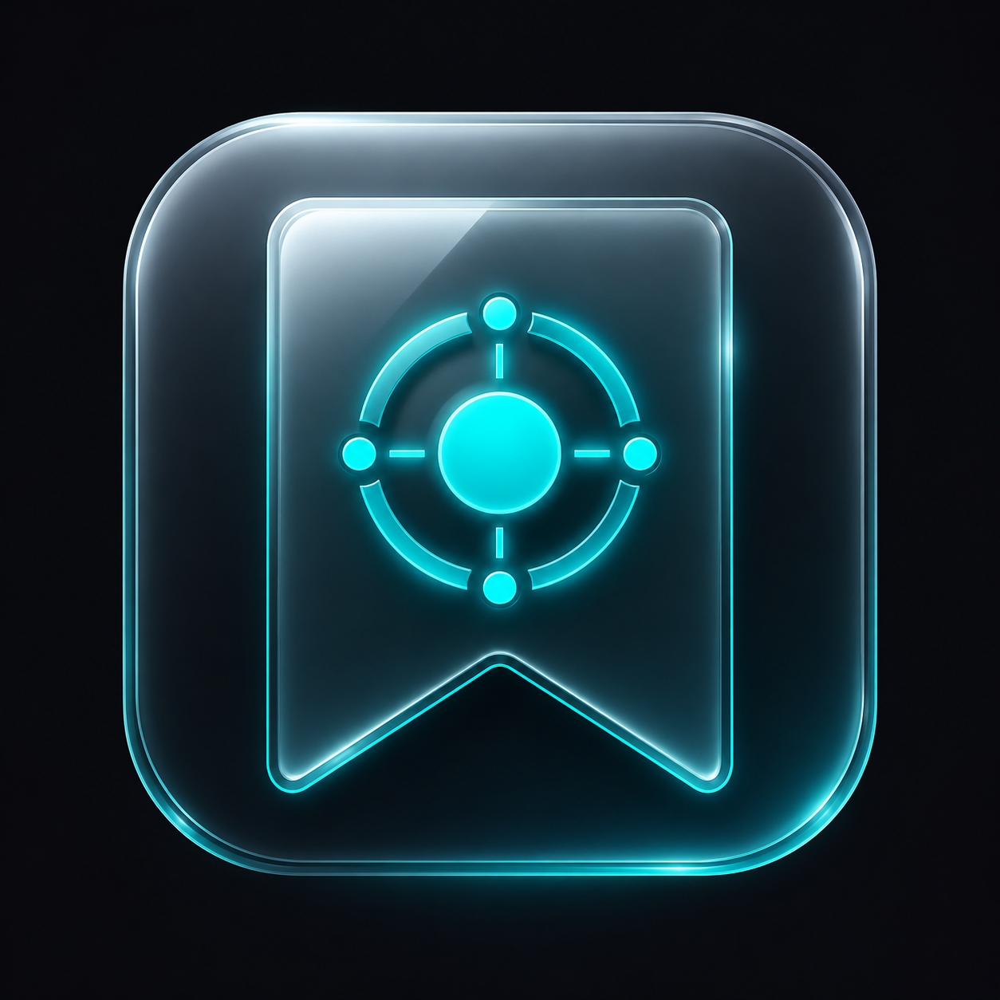

<p align="center">
  
</p>

<h1 align="center">Glass Marks Dashboard 🌟</h1>

<p align="center">
  <strong>A modern, ultra-fast, and keyboard-first Chrome Extension for managing your bookmarks with a futuristic glassmorphism aesthetic.</strong>
</p>

<p align="center">
  
  
  
  
</p>

---

## ✨ Features

### 🎨 1. Futuristic Glassmorphism UI & Custom Themes
- **Dynamic Ambient Glow:** Deep dark-mode backdrop with glowing accent illumination.
- **8 Curated Neon Themes:** Choose from Cyan, Purple, Emerald, Crimson, Pink, Amber, Indigo, or Lime.
- **Sticky & Scrollable Modals:** Clean, responsive settings and dialogs that look great on any screen size.

### 🏷️ 2. Per-Category Customization & Smart Navigation
- **Custom Category Emojis:** Set custom emojis for each category (e.g. 🧠 AI, 💻 Dev, 🎨 Design) with smart auto-detection.
- **Category Accent Colors:** Customize color dots and left-border glow per category collection.
- **Quick-Nav Pills:** Instant jump pills with color indicators and emojis at the top of your dashboard.
- **Editable In-Place:** Rename categories and descriptions directly by clicking the titles.
- **Flexible Sorting:** Sort bookmarks per category by **Manual (Drag & Drop)**, **Name (A-Z)**, **Most Visited (🔥 Clicks)**, or **Recently Added (⏱️)**.

### ⌨️ 3. Full Keyboard-First Workflow
Navigate and manage your entire bookmark collection without touching your mouse:
- **`↓` (Down Arrow) / `j`:** Move focus to the first card or next card.
- **`↑` (Up Arrow) / `k`:** Move focus to previous card (or back to search bar).
- **`Enter` / `Space`:** Open selected bookmark.
- **`Delete` / `Backspace`:** Delete selected bookmark (with instant Undo toast).
- **`E`:** Open the Edit Bookmark modal for the active card.
- **`Escape`:** Dismiss focus or close open modals.
- **`/` (Slash):** Jump directly to the search bar.
- **`Alt + N`:** Open the Add Bookmark modal.

### 🛡️ 4. Robust Safety, Backup & Chrome 2-Way Sync
- **5-Second Undo Toast:** Accidentally deleted a bookmark? Restore it with one click or wait for auto-dismiss with a visual progress bar.
- **Auto-Backup Snapshots:** Automatically saves up to 5 historical restore points before major actions.
- **JSON Export / Import:** Export your full library and restore anytime with clean, styled backup cards.
- **Chrome 2-Way Sync:**
  - **Pull from Chrome:** Import all native browser bookmarks into Glass Marks.
  - **Push to Chrome:** Export your Glass Marks collections directly back into Chrome's bookmarks folder.

### 🏆 5. Gamified Visit Tracking & Leaderboard
- **Click Analytics:** Automatically tracks visit counts on each bookmark.
- **Hot Badges:** Shows flame badges (`🔥 50+ clicks`) on popular links.
- **Leaderboard Modal:** Displays your top most-visited bookmarks ranked with Gold, Silver, and Bronze medals 🥇🥈🥉.

---

## ⌨️ Keyboard Shortcuts Cheat Sheet

| Shortcut | Action | Description |
| :--- | :--- | :--- |
| `Alt + M` | **Open Glass Marks** | Global extension launcher from any web page (customizable in `chrome://extensions/shortcuts`) |
| `/` | **Focus Search** | Instantly highlights search bar (configurable in Settings) |
| `Alt + N` | **New Bookmark** | Opens the Add Bookmark dialog (configurable in Settings) |
| `↓` or `j` | **Next Bookmark** | Focus next bookmark card with glowing neon ring |
| `↑` or `k` | **Previous Bookmark** | Focus previous bookmark card (or search bar) |
| `Enter` / `Space` | **Open Bookmark** | Launches focused bookmark in a new tab |
| `E` | **Edit Bookmark** | Opens edit modal for the currently focused card |
| `Delete` / `Backspace` | **Delete Bookmark** | Triggers deletion with 5s Undo Toast |
| `Escape` | **Close / Unfocus** | Unfocuses card or closes open modal |

---

## 🚀 Installation Guide (Developer Mode)

Since this extension runs directly from source, you can load it in Google Chrome in seconds:

1. **Clone or Download** this repository:
   ```bash
   git clone https://github.com/Zealotch/Glass-Marks.git
   ```
2. Open Google Chrome and navigate to `chrome://extensions/`.
3. Enable **"Developer mode"** by toggling the switch in the top right corner.
4. Click the **"Load unpacked"** button in the top left.
5. Select the folder containing `manifest.json`.
6. Pin **Glass Marks** to your browser toolbar for one-click access!

---

## 🛠️ Architecture & Tech Stack

- **Manifest V3:** Modern Chrome Extension architecture.
- **Vanilla JavaScript (ES Modules):** Clean modular separation (`state.js`, `ui.js`, `dragdrop.js`, `settings.js`, `utils.js`, `dom.js`, `main.js`).
- **Pure CSS3:** Native CSS variables, glassmorphism backdrop filters, and responsive animations.
- **Zero Third-Party Dependencies:** Lightweight, private, and blazing fast with 0 external tracking.

---

## 📄 License

This project is open source and available under the [MIT License](LICENSE).
